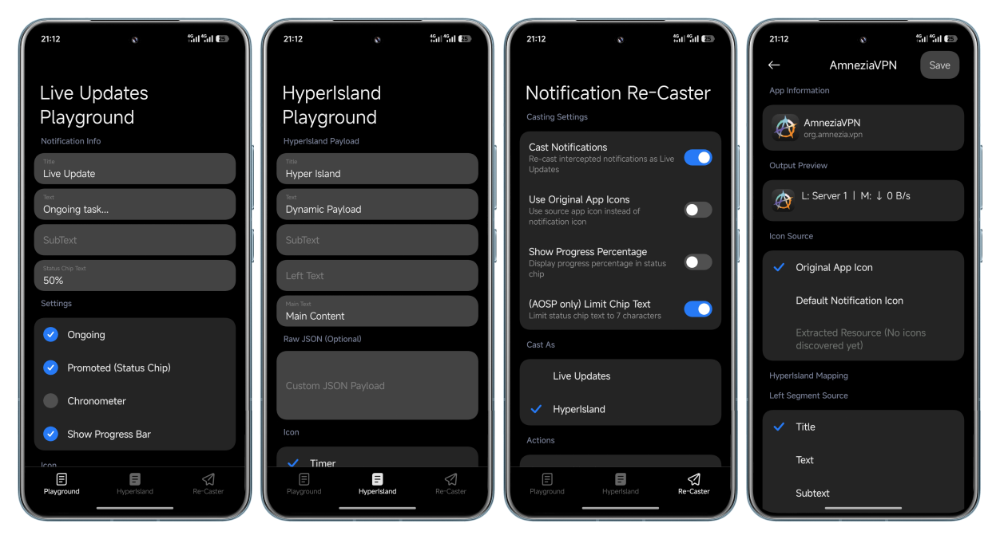
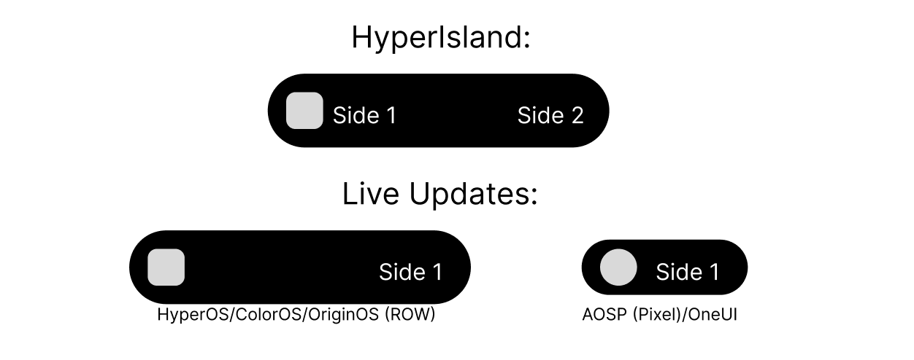

# CunnyPlayground
*no, don't question the name.*



### This application serves as a:
- Playground for the Live Updates API
- Playground for the HyperIsland API
- Notification recaster to: [Live Updates/HyperIsland]

### Features:
- Proper testplace for sending Live Updates (Title/SubTitle/Subtext/Status Chip (setSmallText))
- Proper testplace for sending HyperIsland (Title/SubTitle/Subtext/Status Chip (setSmallText)) **OR** sending a JSON payload with `miui.focus.param` property, defining the whole island, it's content and styles.
- Per-app configurator contains full notification dump inspection, including internal contents of remoteViews, and a preview render of a `bigContentView` remoteView island.
- [hyper_playground.py](hyper_playground.py) - A desktop Tkinter app to send HyperIsland payloads to your device. `adb shell am broadcast -n com.thevakhovske.cunnyplayground/.HyperCommandReceiver -a com.thevakhovske.cunnyplayground.SEND_HYPER --es file {payload}.json`
- Re-casting notifications as Live Updates or HyperIslands with considerable customization:
    * Live Updates: 
        * Set small icon by setting: App Icon/Notification Icon/First extracted drawable from a remoteView if such exists;
        * Set status chip text as: Text, Subtext or Content, and modify it's appearance via regex.
    * HyperIsland: 
        * Set small icon by setting: App Icon/Notification Icon/First extracted drawable from a remoteView if such exists;
        * Set each island side text as: Text, Subtext or Content, and modify it's appearance via regex.

A brief demonstration on how each type will look like on several UIs (small island/status chip only):



### How to use:
1. Install the app
2. Provide notification and notification listening permissions
3. If required, add the app into autostart/background restriction exceptions

## Information:

### This app requests following permissions:
- `android.permission.POST_NOTIFICATIONS`
- `android.permission.POST_PROMOTED_NOTIFICATIONS`
- `android.permission.USE_FULL_SCREEN_INTENT`
- `android.permission.FOREGROUND_SERVICE`
- `android.permission.FOREGROUND_SERVICE_SPECIAL_USE`
- `android.permission.QUERY_ALL_PACKAGES`
- `android.permission.READ_EXTERNAL_STORAGE`

### This app utilizes following libraries:
- [HyperIsland Toolkit `io.github.d4viddf:hyperisland_kit`](https://github.com/D4vidDf/HyperIsland-ToolKit) - Used for simplifying initial bringup of HyperIsland payload sending
- [MIUIX `top.yukonga.miuix.kmp`](https://github.com/yukonga/miuix) - Used for HyperOS-like UI design

## For developers and build reproduction:

### Prerequisites:
- Android Studio
- Gradle/Android (S/N)DK (you're going to install those via Android Studio 9/10 of the times)

### Build:
```bash
./gradlew assembleDebug
```

### Run:
```bash
./gradlew runDebug
```


